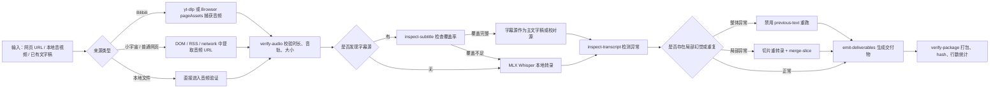
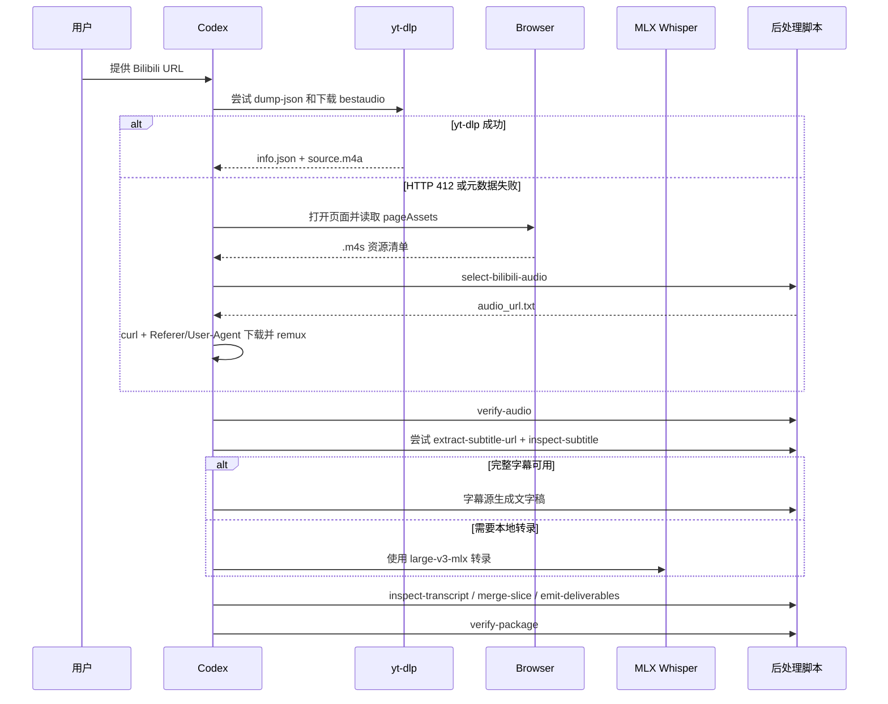
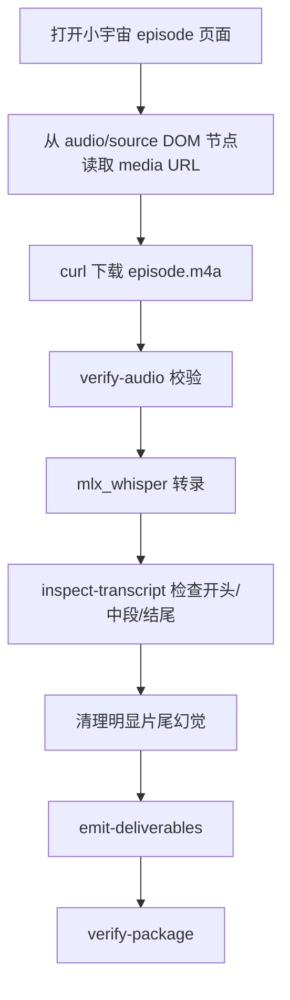
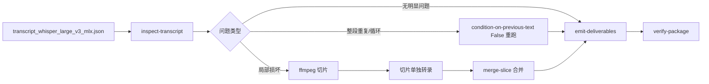

# Audio Transcription Skill


这是一个面向 Codex 的音视频转录 Skill，重点服务于 Apple Silicon 本地转录场景。它把音频提取、MLX Whisper 转录、Bilibili 兜底下载、字幕源处理、幻觉检测、切片修复、时间戳翻译、说话人标注、交付物生成与打包校验整理成一套可复用流程。

## 适用场景

| 场景 | 支持能力 | 主要产物 |
| --- | --- | --- |
| Bilibili 视频转录 | `yt-dlp` 下载、HTTP 412 浏览器兜底、B站字幕源优先策略、财经术语 prompt | `transcript_no_timestamps.md`、`summary_arguments.md`、`srt/vtt/json/zip` |
| 小宇宙播客转录 | DOM 中提取音频 URL、长播客后台转录、片尾幻觉检测 | `transcript.md`、`transcript_timestamped.txt`、`transcript_package.zip` |
| 本地音视频文件 | `ffprobe` 音频验证、MLX Whisper 转录、统一交付物 | `txt/md/srt/vtt/json` |
| 时间戳文本翻译 | 保留时间戳前缀、Argos Translate、缓存、分批写入、样本报告 | `transcript_timestamped_zh.txt`、翻译报告 |
| 说话人标注 | pyannote 分离、MPS 加速、锚点映射、质量诊断 | `transcript_speaker_labeled_pyannote.*`、诊断报告 |
| 转录质量修复 | 重复幻觉检测、禁用 previous-text 重跑、局部切片重转录、自动合并 | `transcript_clean.json`、清洁版字幕 |

## 仓库结构

```text
audio-transcription-skill/
├── SKILL.md
├── README.md
├── .github/
│   └── workflows/
│       └── ci.yml
├── agents/
│   └── openai.yaml
├── docs/
│   └── assets/
│       └── audio-transcription-cover.svg
├── references/
│   ├── bilibili-video-transcription.md
│   ├── mlx-whisper-local-setup.md
│   ├── speaker-diarization-podcasts.md
│   ├── timestamped-transcript-translation.md
│   └── xiaoyuzhou-mlx-whisper.md
└── scripts/
    ├── privacy_scan.py
    ├── validate_skill.py
    ├── diarize_pyannote_merge.py
    ├── transcription_postprocess.py
    └── translate_timestamped_transcript.py
└── tests/
    ├── fixtures/
    └── test_*.py
```

## 核心流程总览



## 安装方式

将仓库克隆到 Codex Skill 目录：

```bash
git clone git@github.com:ambition0802/audio-transcription-skill.git \
  "${CODEX_HOME:-$HOME/.codex}/skills/audio-transcription"
```

验证 Skill 结构：

```bash
python3 "${CODEX_HOME:-$HOME/.codex}/skills/.system/skill-creator/scripts/quick_validate.py" \
  "${CODEX_HOME:-$HOME/.codex}/skills/audio-transcription"
```

设置脚本路径变量，后续命令都会用到：

```bash
export SKILL_DIR="${CODEX_HOME:-$HOME/.codex}/skills/audio-transcription"
```

## 依赖准备

基础工具：

```bash
which ffmpeg || brew install ffmpeg
which uvx || python3 -m pip install --user uv
```

一次性使用 MLX Whisper：

```bash
uvx --from mlx-whisper mlx_whisper --help
```

稳定安装 MLX Whisper：

```bash
uv tool install mlx-whisper
which mlx_whisper
mlx_whisper --help
```

默认转录模型：

```text
mlx-community/whisper-large-v3-mlx
```

只有当用户明确要求速度优先时，才使用：

```text
mlx-community/whisper-large-v3-turbo
```

## 主要脚本

### 1. `transcription_postprocess.py`

统一处理下载后验证、B站资源选择、字幕 URL 提取、幻觉检测、切片合并、交付物生成和打包。

```bash
python3 "$SKILL_DIR/scripts/transcription_postprocess.py" --help
```

| 子命令 | 作用 |
| --- | --- |
| `select-bilibili-audio` | 从 Browser `pageAssets` JSON 中选择 Bilibili 音频 `.m4s` |
| `extract-subtitle-url` | 从 Bilibili 字幕接口响应中提取 `subtitle.bilibili.com` URL |
| `inspect-subtitle` | 检查 Bilibili 字幕首尾时间、覆盖率、空字幕比例 |
| `verify-audio` | 调用 `ffprobe` 检查音频时长、大小、音轨和 hash |
| `build-metadata` | 生成或合并 `info_manual.json`，兼容 `bvid/duration_seconds/uploader_observed_on_page` 等别名 |
| `inspect-transcript` | 检测 Whisper 重复、短 token 循环、高压缩率异常文本 |
| `merge-slice` | 将局部重转录片段合并回完整 JSON |
| `emit-deliverables` | 从结构化 JSON 生成 `txt/md/srt/vtt/json` |
| `verify-package` | 生成 zip 包、统计行数、大小和 SHA-256 |

### 2. `translate_timestamped_transcript.py`

翻译已有时间戳逐字稿，同时保留时间戳前缀。

```bash
uvx --from argostranslate python \
  "$SKILL_DIR/scripts/translate_timestamped_transcript.py" \
  transcript_timestamped.txt \
  --out transcript_timestamped_zh.txt \
  --cache translation_cache_en_zh_argos.json \
  --report transcript_timestamped_zh.report.json \
  --require-timestamp
```

特点：

- 保留 `[00:00:00.000 --> 00:00:04.400]` 这类前缀。
- 只翻译正文。
- 自动使用翻译缓存，适合长稿断点续跑。
- 每隔固定行数写出部分结果。
- 输出开头、中段、结尾样本供人工快速检查。
- 支持 `--keep-term` 保护英文术语，支持 `--replace OLD=NEW` 做术语修正。

### 3. `diarize_pyannote_merge.py`

将 pyannote 说话人分离结果与 Whisper 分段合并。

```bash
ffmpeg -y -i episode.m4a -ac 1 -ar 16000 episode_16k.wav

uv run --offline \
  --with 'pyannote.audio==3.3.2' \
  --with 'torch==2.2.2' \
  --with 'torchaudio==2.2.2' \
  --with 'numpy<2' \
  --with 'huggingface_hub<0.25' \
  python "$SKILL_DIR/scripts/diarize_pyannote_merge.py" \
    --audio episode_16k.wav \
    --transcript transcript_clean.json \
    --host-name '<HOST_NAME>' \
    --guest-name '<GUEST_NAME>' \
    --host-anchor '<START,END>' \
    --guest-anchor '<START,END>' \
    --min-speakers 2 \
    --max-speakers 2 \
    --report diarization_quality_report.json
```

它会输出：

- `transcript_speaker_labeled_pyannote.md`
- `transcript_speaker_labeled_pyannote.txt`
- `transcript_speaker_labeled_pyannote.srt`
- `transcript_speaker_labeled_pyannote.json`
- `diarization_quality_report.json`

`HF_TOKEN` 获取顺序：

1. 环境变量 `HF_TOKEN` 或 `HUGGINGFACE_TOKEN`
2. 显式传入的 `--hf-token-file`
3. 常见 shell rc 文件里的 `export HF_TOKEN=...` 或 `export HUGGINGFACE_TOKEN=...`

脚本不会打印 token。

## 开发验证与 CI

仓库内置标准库 `unittest` 测试和 GitHub Actions，不依赖真实音频或真实网页请求。测试使用 `tests/fixtures/` 中的脱敏 JSON，覆盖 Bilibili 音频选择、字幕 URL 提取、字幕覆盖率、交付物生成、切片合并、翻译缓存和 HF token 读取顺序。

```bash
python3 scripts/validate_skill.py .
PYTHONPYCACHEPREFIX=/tmp/audio_skill_pycache python3 -m py_compile scripts/*.py
python3 -m unittest discover -s tests -v
python3 scripts/privacy_scan.py .
```

CI 流程见 [`.github/workflows/ci.yml`](.github/workflows/ci.yml)。

## Bilibili 执行流程



常规路径：

```bash
mkdir -p ~/Downloads/bilibili_transcripts/<BV_ID>
cd ~/Downloads/bilibili_transcripts/<BV_ID>
export SKILL_DIR="${CODEX_HOME:-$HOME/.codex}/skills/audio-transcription"

uvx --from yt-dlp yt-dlp --dump-json --no-playlist '<BILIBILI_URL>' > info.json
python3 "$SKILL_DIR/scripts/transcription_postprocess.py" \
  build-metadata \
  --from-json info.json \
  --out info_manual.json \
  --require title \
  --require duration \
  --require id \
  --fail-on-missing

uvx --from yt-dlp yt-dlp \
  -f 'bestaudio/best' \
  --extract-audio --audio-format m4a --audio-quality 0 \
  --no-playlist \
  -o 'source.%(ext)s' \
  '<BILIBILI_URL>'

python3 "$SKILL_DIR/scripts/transcription_postprocess.py" \
  verify-audio source.m4a \
  --report audio_verification.json
```

Whisper 转录：

```bash
mlx_whisper source.m4a \
  --model mlx-community/whisper-large-v3-mlx \
  --language zh \
  --task transcribe \
  --output-dir . \
  --output-name transcript_whisper_large_v3_mlx \
  --output-format all \
  --verbose False \
  --initial-prompt '这是一个中文 B 站视频。请使用简体中文，保留必要英文术语。'
```

生成交付物：

```bash
python3 "$SKILL_DIR/scripts/transcription_postprocess.py" \
  emit-deliverables transcript_clean.json \
  --metadata info_manual.json \
  --out-dir . \
  --source-kind whisper

python3 "$SKILL_DIR/scripts/transcription_postprocess.py" \
  verify-package \
  --out transcript_summary_package.zip \
  --report package_report.json
```

## 小宇宙执行流程



DOM 提取示例：

```js
Array.from(document.querySelectorAll('audio,source')).map(e => ({
  tag: e.tagName,
  src: e.src,
  html: e.outerHTML.slice(0, 300)
}))
```

下载与验证：

```bash
mkdir -p ~/Downloads/xiaoyuzhou_transcripts/<episode_id>
cd ~/Downloads/xiaoyuzhou_transcripts/<episode_id>
export SKILL_DIR="${CODEX_HOME:-$HOME/.codex}/skills/audio-transcription"

curl -L --fail --retry 3 -o episode.m4a '<media.xyzcdn.net m4a URL>'
python3 "$SKILL_DIR/scripts/transcription_postprocess.py" \
  verify-audio episode.m4a \
  --report audio_verification.json
```

## 质量控制流程



幻觉检测：

```bash
python3 "$SKILL_DIR/scripts/transcription_postprocess.py" \
  inspect-transcript transcript_whisper_large_v3_mlx.json \
  --duration <SECONDS> \
  --report hallucination_report.json
```

整体重跑参数：

```bash
mlx_whisper source.m4a \
  --model mlx-community/whisper-large-v3-mlx \
  --language zh \
  --task transcribe \
  --output-dir . \
  --output-name transcript_noprev \
  --output-format all \
  --verbose False \
  --condition-on-previous-text False \
  --compression-ratio-threshold 2.4 \
  --logprob-threshold -1.0 \
  --no-speech-threshold 0.6 \
  --initial-prompt '<domain terms>'
```

局部切片合并：

```bash
ffmpeg -y -v error -ss <START_SECONDS> -t <DURATION_SECONDS> \
  -i source.m4a -ar 16000 -ac 1 slice.wav

mlx_whisper slice.wav \
  --model mlx-community/whisper-large-v3-mlx \
  --language zh \
  --task transcribe \
  --output-dir . \
  --output-name slice_transcript \
  --output-format all \
  --verbose False \
  --condition-on-previous-text False

python3 "$SKILL_DIR/scripts/transcription_postprocess.py" \
  merge-slice \
  --base transcript_noprev.json \
  --slice slice_transcript.json \
  --start <START_SECONDS> \
  --end <END_SECONDS> \
  --out transcript_clean.json
```

## 交付物

| 文件 | 说明 |
| --- | --- |
| `transcript_no_timestamps.md` | 适合直接阅读的无时间戳 Markdown |
| `transcript_no_timestamps.txt` | 无时间戳纯文本 |
| `transcript_timestamped.txt` | 简单时间戳文本 |
| `transcript_clean.json` | 结构化分段 JSON |
| `transcript_clean.srt` | 字幕文件 |
| `transcript_clean.vtt` | WebVTT 文件 |
| `summary.md` | 总结 |
| `summary_arguments.md` | 论点和论据表 |
| `transcript_package.zip` | 常规转录包 |
| `transcript_summary_package.zip` | 转录 + 总结包 |
| `package_report.json` | 文件大小、行数、SHA-256、缺失项报告 |

## 隐私与安全

这个仓库不应提交以下内容：

- 原始音频、视频、`.m4s`、`.m4a`、`.wav`
- 真实 `HF_TOKEN`、cookies、Bilibili 登录态、浏览器 session
- 带 `auth_key` 的真实字幕 URL
- 用户私人路径和未脱敏任务产物
- 大型模型缓存和 uv 缓存

建议推送前运行：

```bash
python3 scripts/privacy_scan.py .
```

## 验证

```bash
python3 scripts/validate_skill.py .
PYTHONPYCACHEPREFIX=/tmp/audio_skill_pycache python3 -m py_compile scripts/*.py
python3 -m unittest discover -s tests -v
python3 scripts/transcription_postprocess.py --help
python3 scripts/translate_timestamped_transcript.py --help
python3 scripts/diarize_pyannote_merge.py --help
python3 scripts/privacy_scan.py .
```

## 参考文档

- [`references/bilibili-video-transcription.md`](references/bilibili-video-transcription.md)：Bilibili 视频转录流程。
- [`references/xiaoyuzhou-mlx-whisper.md`](references/xiaoyuzhou-mlx-whisper.md)：小宇宙播客提取和转录流程。
- [`references/mlx-whisper-local-setup.md`](references/mlx-whisper-local-setup.md)：MLX Whisper 本地安装说明。
- [`references/speaker-diarization-podcasts.md`](references/speaker-diarization-podcasts.md)：说话人分离流程。
- [`references/timestamped-transcript-translation.md`](references/timestamped-transcript-translation.md)：时间戳文字稿翻译流程。

## 限制

- 机器转录仍需人工复核专有名词、人名、公司名、股票代码和英文术语。
- Bilibili 页面策略会变化，`yt-dlp` 或浏览器资源捕获可能需要按实际页面调整。
- pyannote 模型需要 Hugging Face gated model 授权，且必须接受相关模型条款。
- Argos 翻译适合作为初稿，发布级翻译仍建议人工或 LLM 二次校订。
