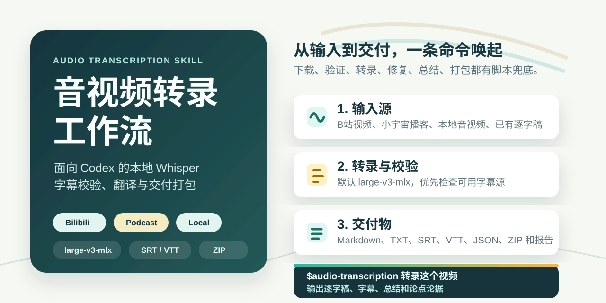
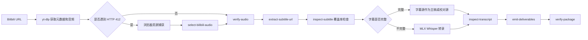
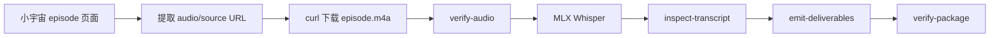
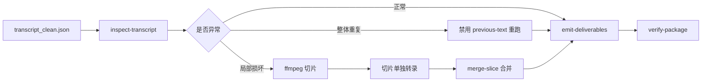

# Audio Transcription Skill



这是一个面向 Codex 的音视频转录 Skill。它把音频下载、MLX Whisper 转录、Bilibili 字幕源校验、幻觉检测、切片修复、时间戳翻译、说话人标注、交付物生成和打包校验整理成一套可复用流程。

适合处理：

- Bilibili 视频转录、总结、论点和论据整理。
- 小宇宙播客或普通网页音频转录。
- 本地 `.m4a`、`.mp3`、`.mp4`、`.wav` 等音视频文件转录。
- 已有时间戳逐字稿的翻译。
- 播客或访谈稿的说话人标注。

## 快速上手

### 1. 安装到 Codex

推荐用 HTTPS 克隆，适合大多数用户：

```bash
git clone https://github.com/ambition0802/audio-transcription-skill.git \
  "${CODEX_HOME:-$HOME/.codex}/skills/audio-transcription"
```

如果你已经配置好 GitHub SSH，也可以用：

```bash
git clone git@github.com:ambition0802/audio-transcription-skill.git \
  "${CODEX_HOME:-$HOME/.codex}/skills/audio-transcription"
```

验证 Skill 结构：

```bash
python3 "${CODEX_HOME:-$HOME/.codex}/skills/.system/skill-creator/scripts/quick_validate.py" \
  "${CODEX_HOME:-$HOME/.codex}/skills/audio-transcription"
```

后续命令建议先设置目录变量：

```bash
export SKILL_DIR="${CODEX_HOME:-$HOME/.codex}/skills/audio-transcription"
```

### 2. 准备依赖

基础依赖：

```bash
which ffmpeg || brew install ffmpeg
which uvx || python3 -m pip install --user uv
```

安装或试运行 MLX Whisper：

```bash
uv tool install mlx-whisper
mlx_whisper --help
```

默认转录模型是：

```text
mlx-community/whisper-large-v3-mlx
```

只有明确要求速度优先时，才建议改用：

```text
mlx-community/whisper-large-v3-turbo
```

### 3. 在 Codex 中直接使用

安装后，你可以在 Codex 里这样提需求：

```text
$audio-transcription 转录这个 B 站视频：https://www.bilibili.com/video/BVxxxx，
输出逐字稿、SRT、VTT、总结，并列出所有论点和对应论据。
```

```text
$audio-transcription 转录 /path/to/interview.m4a，
生成 transcript_no_timestamps.md、transcript_clean.srt 和打包 zip。
```

```text
$audio-transcription 翻译 transcript_timestamped.txt 为中文，
保留每一行时间戳，输出 transcript_timestamped_zh.txt。
```

```text
$audio-transcription 给 transcript_clean.json 做说话人标注，
主持人是 Alice，嘉宾是 Bob。
```

Codex 会按来源类型读取对应参考流程，并优先调用 `scripts/` 中的脚本处理固定步骤。

## 命令行最小示例

如果你想先不用 Codex、直接验证脚本，可以从一个本地音频开始：

```bash
mkdir -p ~/Downloads/audio-transcription-demo
cd ~/Downloads/audio-transcription-demo
export SKILL_DIR="${CODEX_HOME:-$HOME/.codex}/skills/audio-transcription"

cp /path/to/audio.m4a source.m4a

python3 "$SKILL_DIR/scripts/transcription_postprocess.py" \
  verify-audio source.m4a \
  --report audio_verification.json

mlx_whisper source.m4a \
  --model mlx-community/whisper-large-v3-mlx \
  --language zh \
  --task transcribe \
  --output-dir . \
  --output-name transcript_clean \
  --output-format all \
  --verbose False \
  --initial-prompt '这是一个中文音视频内容。请使用简体中文，保留必要英文术语。'

python3 "$SKILL_DIR/scripts/transcription_postprocess.py" \
  emit-deliverables transcript_clean.json \
  --out-dir . \
  --source-kind whisper

python3 "$SKILL_DIR/scripts/transcription_postprocess.py" \
  verify-package \
  --base-dir . \
  --include transcript_clean.json transcript_clean.srt transcript_clean.vtt transcript_no_timestamps.md transcript_timestamped.txt \
  --out transcript_package.zip \
  --report package_report.json \
  --require
```

完成后重点看这些文件：

| 文件 | 用途 |
| --- | --- |
| `transcript_no_timestamps.md` | 适合直接阅读的无时间戳文字稿 |
| `transcript_timestamped.txt` | 带时间戳的逐字稿 |
| `transcript_clean.srt` | 字幕文件 |
| `transcript_clean.vtt` | WebVTT 字幕 |
| `transcript_clean.json` | 结构化分段数据 |
| `transcript_package.zip` | 打包后的交付文件 |
| `package_report.json` | 交付包大小、行数、SHA-256 和缺失项 |

## 常见任务怎么做

### Bilibili 视频

最简单的方式是在 Codex 里给 URL：

```text
$audio-transcription 转录这个 Bilibili 视频：<BILIBILI_URL>，
如果 B 站字幕完整就优先用字幕源校对，否则用 Whisper 转录；
最后输出逐字稿、字幕、总结、论点和论据。
```

内部流程会按这个顺序处理：



手动处理时，核心命令是：

```bash
uvx --from yt-dlp yt-dlp --dump-json --no-playlist '<BILIBILI_URL>' > info.json

uvx --from yt-dlp yt-dlp \
  -f 'bestaudio/best' \
  --extract-audio --audio-format m4a --audio-quality 0 \
  --no-playlist \
  -o 'source.%(ext)s' \
  '<BILIBILI_URL>'

python3 "$SKILL_DIR/scripts/transcription_postprocess.py" \
  verify-audio source.m4a \
  --report audio_verification.json
```

如果你已经拿到 B 站字幕接口响应，可以检查字幕是否足够完整：

```bash
python3 "$SKILL_DIR/scripts/transcription_postprocess.py" \
  extract-subtitle-url subtitle_view_response.json \
  --out subtitle_body_url.txt

curl -L "$(cat subtitle_body_url.txt)" -o subtitle_body.json

python3 "$SKILL_DIR/scripts/transcription_postprocess.py" \
  inspect-subtitle subtitle_body.json \
  --duration <VIDEO_DURATION_SECONDS> \
  --report subtitle_coverage.json \
  --fail-on-incomplete
```

详细流程见 [`references/bilibili-video-transcription.md`](references/bilibili-video-transcription.md)。

### 小宇宙播客

在 Codex 里可以直接给 episode URL：

```text
$audio-transcription 转录这个小宇宙节目：<XIAOYUZHOU_EPISODE_URL>，
生成逐字稿、时间戳文本和 zip 交付包。
```

流程要点：



如果要手动提取网页里的音频 URL，可在浏览器控制台运行：

```js
Array.from(document.querySelectorAll('audio,source')).map((element) => ({
  tag: element.tagName,
  src: element.src,
  html: element.outerHTML.slice(0, 300),
}))
```

详细流程见 [`references/xiaoyuzhou-mlx-whisper.md`](references/xiaoyuzhou-mlx-whisper.md)。

### 时间戳逐字稿翻译

用于把英文时间戳稿翻译成中文，同时保留每一行的时间戳：

```bash
uvx --from argostranslate python \
  "$SKILL_DIR/scripts/translate_timestamped_transcript.py" \
  transcript_timestamped.txt \
  --out transcript_timestamped_zh.txt \
  --cache translation_cache_en_zh_argos.json \
  --report transcript_timestamped_zh.report.json \
  --require-timestamp
```

常用参数：

- `--keep-term TERM`：保护不需要翻译的英文术语。
- `--replace OLD=NEW`：对输出做术语替换。
- `--chunk-size N`：控制分批翻译大小。

详细流程见 [`references/timestamped-transcript-translation.md`](references/timestamped-transcript-translation.md)。

### 说话人标注

说话人分离使用 pyannote，需要 Hugging Face token，并且要接受对应 gated model 条款。

```bash
ffmpeg -y -i episode.m4a -ac 1 -ar 16000 episode_16k.wav

uv run --offline \
  --with 'pyannote.audio==3.3.2' \
  --with 'torch==2.2.2' \
  --with 'torchaudio==2.2.2' \
  --with 'numpy<2' \
  --with 'huggingface_hub<0.25' \
  python "$SKILL_DIR/scripts/diarize_pyannote_merge.py" \
    --audio episode_16k.wav \
    --transcript transcript_clean.json \
    --host-name '<HOST_NAME>' \
    --guest-name '<GUEST_NAME>' \
    --host-anchor '<START,END>' \
    --guest-anchor '<START,END>' \
    --min-speakers 2 \
    --max-speakers 2 \
    --report diarization_quality_report.json
```

`HF_TOKEN` 获取顺序：

1. 环境变量 `HF_TOKEN` 或 `HUGGINGFACE_TOKEN`
2. 显式传入的 `--hf-token-file`
3. 常见 shell rc 文件里的 `export HF_TOKEN=...` 或 `export HUGGINGFACE_TOKEN=...`

脚本不会打印 token。详细流程见 [`references/speaker-diarization-podcasts.md`](references/speaker-diarization-podcasts.md)。

## 脚本速查

### `transcription_postprocess.py`

统一处理音频验证、B 站资源选择、字幕 URL 提取、字幕覆盖率检查、幻觉检测、切片合并、交付物生成和打包。

```bash
python3 "$SKILL_DIR/scripts/transcription_postprocess.py" --help
```

| 子命令 | 作用 |
| --- | --- |
| `select-bilibili-audio` | 从 Browser `pageAssets` JSON 中选择 Bilibili 音频 `.m4s` |
| `extract-subtitle-url` | 从 Bilibili 字幕接口响应中提取 `subtitle.bilibili.com` URL |
| `inspect-subtitle` | 检查 Bilibili 字幕首尾时间、覆盖率、空字幕比例 |
| `verify-audio` | 调用 `ffprobe` 检查音频时长、大小、音轨和 hash |
| `build-metadata` | 生成或合并 `info_manual.json` |
| `inspect-transcript` | 检测 Whisper 重复、短 token 循环、高压缩率异常文本 |
| `merge-slice` | 将局部重转录片段合并回完整 JSON |
| `emit-deliverables` | 从结构化 JSON 生成 `txt/md/srt/vtt/json` |
| `verify-package` | 生成 zip 包、统计行数、大小和 SHA-256 |

### `translate_timestamped_transcript.py`

翻译已有时间戳逐字稿，同时保留时间戳前缀。适合把播客、访谈、会议的英文时间戳稿翻译成中文初稿。

### `diarize_pyannote_merge.py`

将 pyannote 说话人分离结果与 Whisper 分段合并，输出带说话人标签的 `md/txt/srt/json` 和质量诊断报告。

### 验证脚本

| 脚本 | 用途 |
| --- | --- |
| `scripts/validate_skill.py` | 检查 `SKILL.md` frontmatter 和基本结构 |
| `scripts/privacy_scan.py` | 扫描明显 token、cookie、私有路径和真实字幕授权链接 |

## 质量控制

Whisper 输出建议始终跑一次检查：

```bash
python3 "$SKILL_DIR/scripts/transcription_postprocess.py" \
  inspect-transcript transcript_clean.json \
  --duration <SECONDS> \
  --report hallucination_report.json
```

处理策略：



整体重跑常用参数：

```bash
mlx_whisper source.m4a \
  --model mlx-community/whisper-large-v3-mlx \
  --language zh \
  --task transcribe \
  --output-dir . \
  --output-name transcript_noprev \
  --output-format all \
  --verbose False \
  --condition-on-previous-text False \
  --compression-ratio-threshold 2.4 \
  --logprob-threshold -1.0 \
  --no-speech-threshold 0.6 \
  --initial-prompt '<domain terms>'
```

局部切片合并：

```bash
ffmpeg -y -v error -ss <START_SECONDS> -t <DURATION_SECONDS> \
  -i source.m4a -ar 16000 -ac 1 slice.wav

mlx_whisper slice.wav \
  --model mlx-community/whisper-large-v3-mlx \
  --language zh \
  --task transcribe \
  --output-dir . \
  --output-name slice_transcript \
  --output-format all \
  --verbose False \
  --condition-on-previous-text False

python3 "$SKILL_DIR/scripts/transcription_postprocess.py" \
  merge-slice \
  --base transcript_noprev.json \
  --slice slice_transcript.json \
  --start <START_SECONDS> \
  --end <END_SECONDS> \
  --out transcript_clean.json
```

## 仓库结构

```text
audio-transcription-skill/
├── SKILL.md
├── README.md
├── .github/workflows/ci.yml
├── agents/openai.yaml
├── docs/assets/audio-transcription-cover.svg
├── references/
│   ├── bilibili-video-transcription.md
│   ├── mlx-whisper-local-setup.md
│   ├── speaker-diarization-podcasts.md
│   ├── timestamped-transcript-translation.md
│   └── xiaoyuzhou-mlx-whisper.md
├── scripts/
│   ├── diarize_pyannote_merge.py
│   ├── privacy_scan.py
│   ├── transcription_postprocess.py
│   ├── translate_timestamped_transcript.py
│   └── validate_skill.py
└── tests/
    ├── fixtures/
    └── test_*.py
```

## 开发验证与 CI

仓库内置标准库 `unittest` 测试和 GitHub Actions，不依赖真实音频或真实网页请求。测试使用 `tests/fixtures/` 中的脱敏 JSON，覆盖 Bilibili 音频选择、字幕 URL 提取、字幕覆盖率、交付物生成、切片合并、翻译缓存和 HF token 读取顺序。

本地验证：

```bash
python3 scripts/validate_skill.py .
PYTHONPYCACHEPREFIX=/tmp/audio_skill_pycache python3 -m py_compile scripts/*.py
python3 -m unittest discover -s tests -v
python3 scripts/transcription_postprocess.py --help
python3 scripts/translate_timestamped_transcript.py --help
python3 scripts/diarize_pyannote_merge.py --help
python3 scripts/privacy_scan.py .
```

CI 流程见 [`.github/workflows/ci.yml`](.github/workflows/ci.yml)。

## 隐私与安全

这个仓库不应提交以下内容：

- 原始音频、视频、`.m4s`、`.m4a`、`.wav`
- 真实 `HF_TOKEN`、cookies、Bilibili 登录态、浏览器 session
- 带真实 `auth_key` 的字幕 URL
- 用户私人路径和未脱敏任务产物
- 大型模型缓存和 uv 缓存

推送前建议运行：

```bash
python3 scripts/privacy_scan.py .
```

## 常见问题

**为什么默认用 `mlx-community/whisper-large-v3-mlx`？**

它比 turbo 版本更偏精度优先，适合作为默认模型。长音频赶时间时再切到 `mlx-community/whisper-large-v3-turbo`。

**Bilibili 下载遇到 HTTP 412 怎么办？**

用浏览器打开页面，捕获 `pageAssets` 或网络资源，再用 `select-bilibili-audio` 选出 `.m4s` 音频 URL。完整步骤见 Bilibili 参考文档。

**什么时候用 B 站字幕源？**

先用 `inspect-subtitle` 检查覆盖率、首尾时间和空字幕比例。覆盖完整时可以作为主稿或校对源；覆盖不足时回到 Whisper。

**说话人标注为什么需要 token？**

pyannote 的部分模型是 gated model，需要 Hugging Face 授权。脚本会读取 token，但不会打印 token。

**机器转录还要人工复核吗？**

需要。人名、公司名、股票代码、专有名词和英文术语仍建议人工抽查。

## 参考文档

- [`references/bilibili-video-transcription.md`](references/bilibili-video-transcription.md)：Bilibili 视频转录流程。
- [`references/xiaoyuzhou-mlx-whisper.md`](references/xiaoyuzhou-mlx-whisper.md)：小宇宙播客提取和转录流程。
- [`references/mlx-whisper-local-setup.md`](references/mlx-whisper-local-setup.md)：MLX Whisper 本地安装说明。
- [`references/speaker-diarization-podcasts.md`](references/speaker-diarization-podcasts.md)：说话人分离流程。
- [`references/timestamped-transcript-translation.md`](references/timestamped-transcript-translation.md)：时间戳文字稿翻译流程。

## 限制

- 当前流程主要面向 Apple Silicon + MLX Whisper。
- Bilibili 页面策略会变化，`yt-dlp` 或浏览器资源捕获可能需要按实际页面调整。
- pyannote 模型需要 Hugging Face gated model 授权，且必须接受相关模型条款。
- Argos 翻译适合作为初稿，发布级翻译仍建议人工或 LLM 二次校订。
